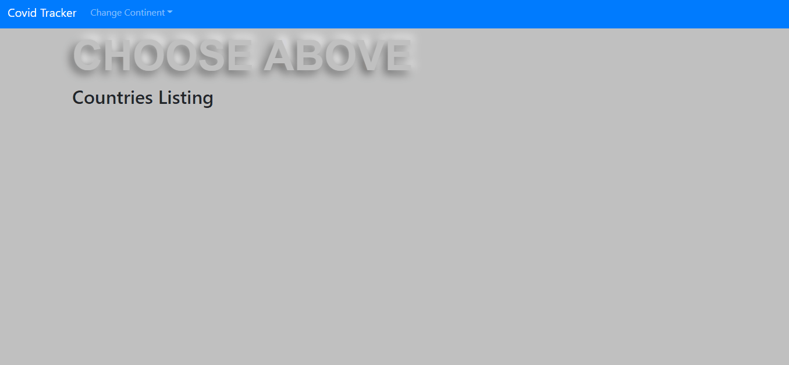

# Covid Tracker

<br />
<p align="center">
  <a href="https://github.com/simandebvu/CovidTracker/">
    
  </a>

  <h3 align="center">Covid Tracker</h3>

  <p align="center">
    A React Based Project
    <br />
    <a href="https://github.com/simandebvu/CovidTracker/issues/"><strong>Issues »</strong></a>
    <br />
    <br />
    <a href="https://github.com/simandebvu/CovidTracker/issues/">Report Bug</a>
    ·
    <a href="https://github.com/simandebvu/CovidTracker/">Request Feature</a>
  </p>
</p>

>  A catalogue of statistics for covid19, a browsable list of items that you can filter and access to the details of one country. It consists of two pages, bundled with the react router - that shows details and filter-able global views of countries.

## Table Of Contents

- [Covid Tracker](#covid-tracker)
  - [Table Of Contents](#table-of-contents)
  - [Built With](#built-with)
  - [Usage](#usage)
  - [Live Demo](#live-demo)
  - [Live Video Presentation](#live-video-presentation)
  - [Authors](#authors)
  - [🤝 Contributing](#-contributing)
  - [Show your support](#show-your-support)
  - [Acknowledgments](#acknowledgments)
  - [📝 License](#-license)



## Built With

- Node.js
- React
- React-DOM
- React-Create-App
- React Hooks
- Jest
- React Testing Library
- npm
- CSS
- ES6
  
## Usage

To have this app on your pc, you need to:
* [download](https://github.com/simandebvu/CovidTracker/archive/development.zip) or clone this repo:
  - Clone with SSH:
  ```
    git@github.com:simandebvu/CovidTracker.git
  ```
  - Clone with HTTPS
  ```
    https://github.com/simandebvu/CovidTracker.git
  ```

* In the project directory, you can run:

  - `$ npm install` - installs all the dependencies required by the project

  - `$ npm start` - runs the app in the development mode:
    - Open [http://localhost:3000](http://localhost:3000) to view it in the browser.
    - The page will reload if you make edits.
    - You will also see any lint errors in the console.

  - `$ npm run build`
    - Builds the app for production to the `build` folder.
    - It correctly bundles React in production mode and optimizes the build for the best performance.
    - The build is minified and the filenames include the hashes.
    - Your app is ready to be deployed!
 
## Live Demo 

[Live Demo Link](https://covid-tracker-sm.netlify.app) :point_left:

## Live Video Presentation 

[Live Video Link](https://www.loom.com/share/d19246c5eb2f46e987e443c314ca052f) :point_left:


## Authors

👤 **Shingirayi Mandebvu**

- Github: [@simandebvu](https://github.com/simandebvu)
- Twitter: [@simandebvu](https://twitter.com/simandebvu)
- Linkedin: [linkedin](https://linkedin.com/in/simandebvu)

## 🤝 Contributing

Contributions, issues and feature requests are welcome!

Feel free to check the [issues page](issues/).

## Show your support

Give a ⭐️ if you like this project!

## Acknowledgments

- Microverse

## 📝 License

This project is [MIT](lic.url) licensed.
